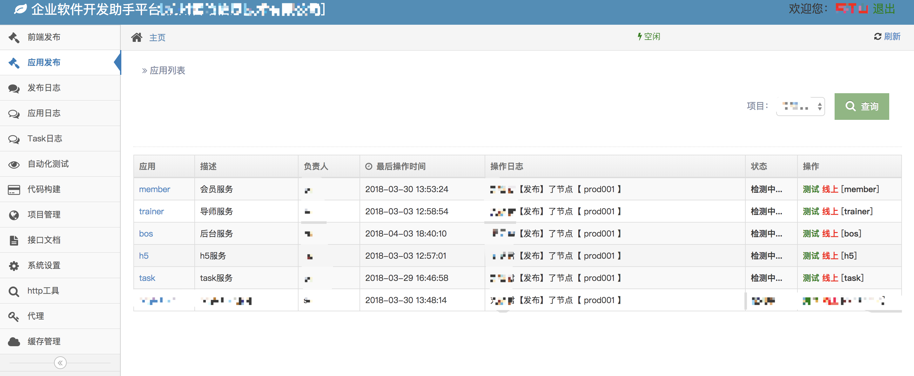
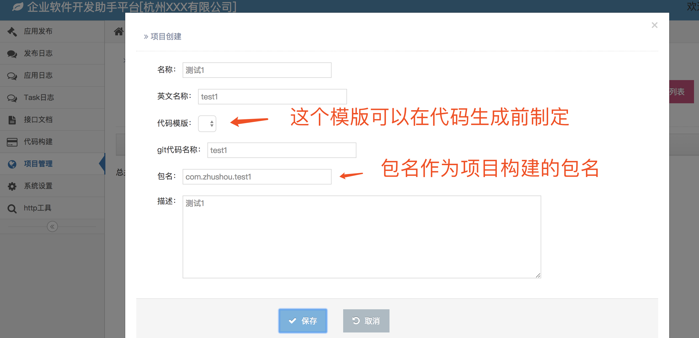
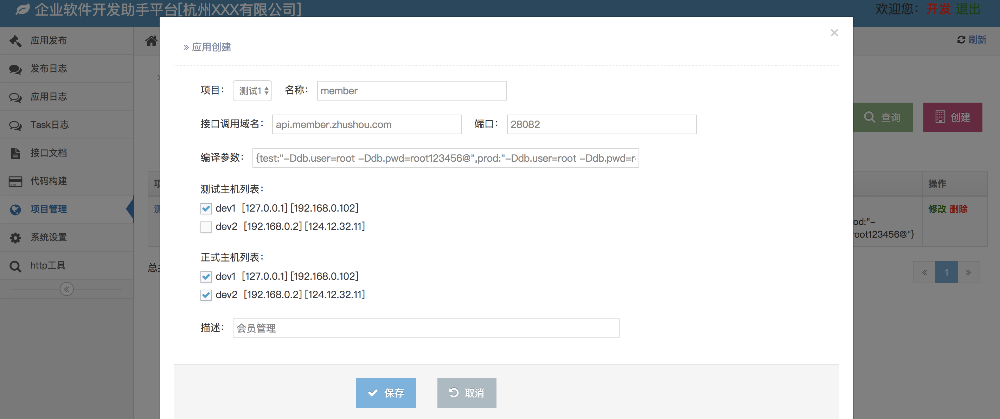
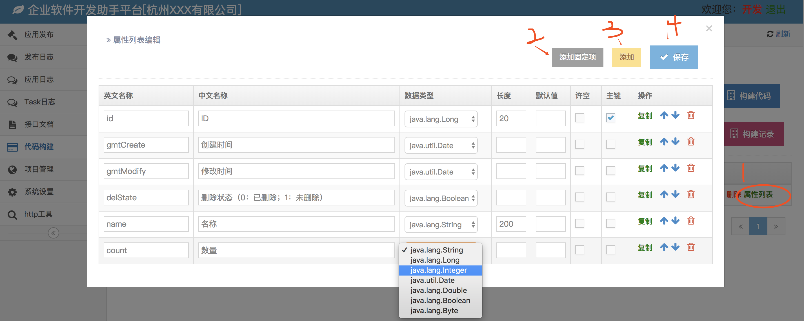
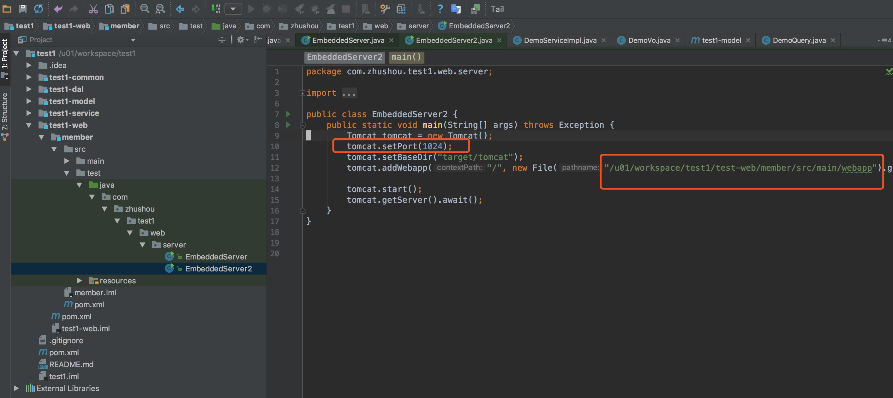

# 企业软件开发助手管理平台

<!-- TOC -->

- [企业软件开发助手管理平台](#企业软件开发助手管理平台)
    - [目标](#目标)
    - [功能说明](#功能说明)
    - [使用说明](#使用说明)
    - [安装](#安装)
        - [配置环境](#配置环境)
        - [编译 AND 运行](#编译-and-运行)
    - [详细使用流程](#详细使用流程)
        - [登录](#登录)
            - [用户账号](#用户账号)
        - [项目管理](#项目管理)
            - [项目](#项目)
            - [主机](#主机)
            - [应用](#应用)
        - [代码构建](#代码构建)
            - [代码模版](#代码模版)
        - [编译部署](#编译部署)
        - [日志跟踪](#日志跟踪)
        - [接口文档](#接口文档)
        - [其他功能](#其他功能)
    - [环节业务整合](#环节业务整合)

<!-- /TOC -->

## 目标

> 一个软件开发公司在进行软件开发的时候，最好能有一个辅助软件的开发的工具，让开发人员更多的时间去关注业务，
让代码构建，测试，联调，编译部署，生产监控都让外围工具帮你搞定，这个工具平台贯穿软件开发的生命周期的每一个环节，
彻底解放程序猿的劳动力。

## 功能说明

* 项目管理
* 代码构建
* 接口文档管理
* 编译发布（前端 AND 后台）
* 日志管理（应用 AND task）
* 自动化测试
* Http工具



## 使用说明

> 本工具平台的各个功能通过配置能单独跟你的业务打通，但最好整套（从代码构建到生产部署）直接利用

## 安装

### 配置环境
* jdk 1.7 或以上
* maven 3.x
* redis 3.x
* mysql 5.6 或以上
* git clone git@github.com:tss0823/zhushou.git
* 将项目根目录数据库脚本[/zhushou_init.sql](zhushou_init.sql)导入数据库(自己创建一个库)中
* 配置好配置文件[/conf/config.properties](conf/config.properties)
```
jdbc.driverClassName=com.mysql.jdbc.Driver
jdbc.url=jdbc:mysql://localhost:3306/zhushou_init
jdbc.username=root
jdbc.password=123456
redis.host=localhost
redis.port=6389
redis.pwd=zhushou123
redis.namespace=zhushou_dev
```
mysql,redis 根据自己环境来配置，其他的默认就好

### 编译 AND 运行
1. sh compile.sh 
2. sh run.sh deploy
3. sh run.sh client

admin 表示管理，管理端负责用户的交互。client 表示客户端，客户端主要管理服务器节点。

## 详细使用流程

### 登录
#### 用户账号
* 管理员 admin/123456
* 开发   dev/123456
* 前端   front/123456
* 测试   test/123456

默认deploy的访问地址
[http://localhost:1027/index.html](http://localhost:1027/index.html)


### 项目管理
流程
> 创建项目 > 创建主机 > 创建应用

#### 项目
> 项目是根据业务来，一个项目包含很多应用，而应用可以展现在不同的端（pc,mobile）


项目的创建英文名称很重要，最好在公司层面是唯一的这样就不会混淆，代码模版是成成代码所需，后续介绍版本的时候详细说明，
包名也是生成代码的项目工程的java包名。


配置项是针对项目的配置文件的key-value变量，其中包括数据库，缓存等配置，用户可以根据自己的业务配置这个。


#### 主机
主机的元素包括名称，内网地址，外网地址

#### 应用

应用的名称用英文，涉及到后面的代码构建，调用域名和端口组成对外提供的接口地址，编译参数作为隐藏开发的配置（json格式）。


### 代码构建
流程
> 上传模版 > 创建实体 > 生成SQL OR 构建代码


#### 代码模版


创建模版，选择模版文件，模版资源下载地址 [https://github.com/tss0823/template](https://github.com/tss0823/template)
[https://github.com/tss0823/template_single](https://github.com/tss0823/template_single)

现在到本地，执行 sh compress.sh 获取xxx.zip ，然后把它上传到模版库中，当然用户也可以根据自己的业务项目构建属于自己的模版


创建实体后，选择属性列表，添加实体的属性，每个属性对于数据库表中的一个字段，添加固定项是默认的属性，最好把默认都加进去。


构建SQL,选择要构建的实体会弹出所选实体的表结构SQL,我们将sql复制导入到我们要创建的项目数据库中即可。


构建代码，在构建前，我们先必须保证项目中必须设置好了模版，通过修改项目可以设置。完成后，选择您要构建的实体，点 "构建代码"，构建需要耗点时间，成功后将弹出如下图，我们可以下载项目，当然我们在构建记录中
也可以找到。


下载解压后，我们获取如下目录构建的文件，这样一个包含实体的完整项目就生成好了，我们把它导入到IDE(idea or eclipse)中就可以运行了


我这里用idea,找到 `EmbeddedServer2`这个类，如下图所示，设置好对应的端口和webapp路径，就可以通过嵌入式tomcat执行了。


然后我们通过curl 来测试服务器状态接口，通过执行返回是`checkServerStatusIsOK`,说明是Ok的。
```
Apr 22, 2018 5:32:22 PM org.apache.coyote.AbstractProtocol start
信息: Starting ProtocolHandler ["http-nio-1024"]
pili:test1 shan$ curl http://localhost:1024/checkServerStatus
checkServerStatusIsOK
pili:test1 shan$
```

### 编译部署

### 日志跟踪

### 接口文档

### 其他功能

## 环节业务整合


